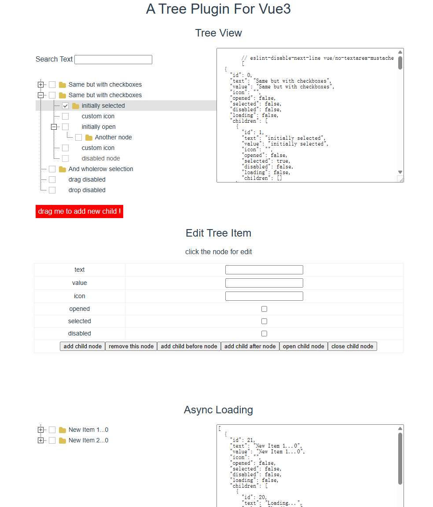

# vue-sapling-tree

[](https://github.com/rwerplus/vue-sapling-tree)



[English](./README.md)/[中文](./README-CN.md)

## Introduction

这是一个为 Vue 3 量身打造、支持 TypeScript 的现代化树形组件库。它可以让您在 Web 应用中轻松构建动态、互动的树形结构。Vue 3 JSTree 是原 vue-jstree（针对 Vue 2 的一个树形插件）的完全重写版本，采用了 Vue 3 的组合 API 和 TypeScript，以提供更好的类型检查和开发体验。


## 特性

- 完全兼容 Vue 3 和 TypeScript。
- 支持从 JSON 数据动态构建树。
- 节点可自定义，支持复选框、图标和拖放功能。
- 支持大型数据集的异步数据加载。
- 通过插槽和 CSS 实现高度自定义。
- 节点点击、切换、拖放等事件。
- 易于集成到 Vue 3 项目中，提供现代化、响应式 API。

## 例子

[http://rwerplus.github.io/vue-sapling-tree](http://rwerplus.github.io/vue-sapling-tree)

## NPM

```shell
npm install vue-sapling-tree
```

## ES6

```ts
import VSaplingTree from 'vue-sapling-tree'
new Vue({ components: { VSaplingTree } })
```

## 简单示例

```ts
    <v-sapling-tree v-model:treeData="data" show-checkbox multiple allow-batch whole-row @item-click="itemClick"></v-sapling-tree>

    new Vue({
      data: {
        data: [
          {
            "text": "Same but with checkboxes",
            "children": [
              {
                "text": "initially selected",
                "selected": true
              },
              {
                "text": "custom icon",
                "icon": "fa fa-warning icon-state-danger"
              },
              {
                "text": "initially open",
                "icon": "fa fa-folder icon-state-default",
                "opened": true,
                "children": [
                  {
                    "text": "Another node"
                  }
                ]
              },
              {
                "text": "custom icon",
                "icon": "fa fa-warning icon-state-warning"
              },
              {
                "text": "disabled node",
                "icon": "fa fa-check icon-state-success",
                "disabled": true
              }
            ]
          },
          {
            "text": "Same but with checkboxes",
            "opened": true,
            "children": [
              {
                "text": "initially selected",
                "selected": true
              },
              {
                "text": "custom icon",
                "icon": "fa fa-warning icon-state-danger"
              },
              {
                "text": "initially open",
                "icon": "fa fa-folder icon-state-default",
                "opened": true,
                "children": [
                  {
                    "text": "Another node"
                  }
                ]
              },
              {
                "text": "custom icon",
                "icon": "fa fa-warning icon-state-warning"
              },
              {
                "text": "disabled node",
                "icon": "fa fa-check icon-state-success",
                "disabled": true
              }
            ]
          },
          {
            "text": "And wholerow selection"
          }
        ]
      },
      methods: {
        itemClick (node) {
          console.log(node.model.text + ' clicked !')
        }
      }
    })
```

## API

| Props                      |   Type   |  Default   | Describe                                                                                                                     |
| -------------------------- | :------: | :--------: | :--------------------------------------------------------------------------------------------------------------------------- |
| treeData                   |  Array   |            | 设置树的数据源                                                                                                               |
| size                       |  String  |            | 设置树节点的大小, 可选值 : 'large' or '' or ''small'                                                                         |
| show-checkbox              | Boolean  |   false    | 设置是否显示选择框                                                                                                           |
| allow-transition           | Boolean  |    true    | 设置是否允许使用过渡效果                                                                                                     |
| whole-row                  | Boolean  |   false    | 设置是否整个树节点高亮                                                                                                       |
| no-dots                    | Boolean  |   false    | 设置是否显示树节点前的虚线                                                                                                   |
| collapse                   | Boolean  |   false    | 设置节点全部展开或合并的初始值，不设置按节点自身的 opened 属性控制                                                           |
| multiple                   | Boolean  |   false    | 设置是否可以多选                                                                                                             |
| allow-batch                | Boolean  |   false    | 设置允许批量选择子节点                                                                                                       |
| text-field-name            |  String  |   'text'   | 设置 **文字** 的字段名称，默认为 **text**                                                                                    |
| value-field-name           |  String  |  'value'   | 设置 **值** 的字段名称，默认为 **value**                                                                                     |
| children-field-name        |  String  | 'children' | 设置 **子节点** 的字段名称，默认为 **children**                                                                              |
| item-events                |  Object  |     {}     | 注册任意事件到每个数节点上, [例子](https://github.com/zdy1988/vue-jstree/blob/master/App.vue)                                |
| async                      | Function |            | 异步加载数据的回调函数 , 如果当前节点没有子项 ,设置树节点中的 'isLeaf: true' 可不现实 + 号                                   |
| loading-text               |  String  | 'Loading'  | 设置 Loading 文字                                                                                                            |
| draggable                  | Boolean  |   false    | 设置是否启用拖拽 , 默认全部节点可拖拽, 如自定义个别节点禁用拖拽或禁用拖放可设置 'dragDisabled: true' 和 'dropDisabled: true' |
| drag-over-background-color |  String  | '#C9FDC9'  | 设置拖拽进入节点时的背景色                                                                                                   |
| klass                      |  String  |            | 设置追加 class                                                                                                               |

## node.model 中的方法

| Method        |                   Params                    |
| ------------- | :-----------------------------------------: |
| addChild      |            (object) newDataItem             |
| addAfter      | (object) newDataItem, (object) selectedNode |
| addBefore     | (object) newDataItem, (object) selectedNode |
| openChildren  |                                             |
| closeChildren |                                             |

## 可选择事件

**@item-click(node, item, e)**

**@item-toggle(node, item, e)**

**@item-drag-start(node, item, e)**

**@item-drag-end(node, item, e)**

**@item-drop-before(node, item, draggedItem, e)**

**@item-drop(node, item, draggedItem, e)**

**node** : current node vue object

**item** : current node data item object

**e** : event

## 节点的数据参数

| Name         |  Type   | Default | Describe                                    |
| ------------ | :-----: | ------: | :------------------------------------------ |
| icon         | String  |         | 自定义图标样式 class                        |
| opened       | Boolean |   false | 设置节点展开或合并                          |
| selected     | Boolean |   false | 设置节点被选择                              |
| disabled     | Boolean |   false | 设置禁用节点                                |
| isLeaf       | Boolean |   false | 如果节点没有子项 , 设置为 true 可以隐藏 '+' |
| dragDisabled | Boolean |   false | 设置当前节点禁止拖拽                        |
| dropDisabled | Boolean |   false | 设置当前节点禁止拖放                        |

## 自定义树节点的例子

```ts
<v-sapling-tree v-model:data="data">
  <template scope="_">
    <div style="display: inherit; width: 200px" @click.ctrl="customItemClickWithCtrl">
      <i :class="_.vm.themeIconClasses" role="presentation" v-if="!_.model.loading"></i>
      {{_.model.text}}
      <button style="border: 0px; background-color: transparent; cursor: pointer;" @click="customItemClick(_.vm, _.model, $event)"><i class="fa fa-remove"></i></button>
    </div>
  </template>
</v-sapling-tree>

```

更优雅的操作方式:

```ts
<v-sapling-tree v-model:data="data">
  <template scope="_">
    <div style="display: inherit; width: 200px" @click.ctrl="customItemClickWithCtrl" @click.exact="customItemClick(_.vm, _.model, $event)">
    <i :class="_.vm.themeIconClasses" role="presentation" v-if="!_.model.loading"></i>
    {{_.model.text}}
    </div>
  </template>
</v-sapling-tree>
```

## License

Licensed under the [MIT license](https://opensource.org/licenses/mit-license.php).

Thanks For [jstree](https://github.com/zdy1988/vue-jstree)'s repository

Thanks For [jstree](https://github.com/vakata/jstree)'s UI
